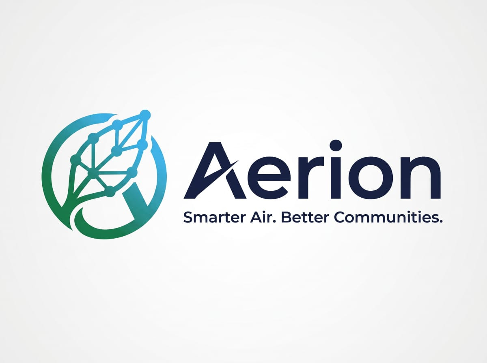

<div align="center">
  
</div>

# AERION Intelligence 🌍

AERION Intelligence is a **Unified Environmental Intelligence Platform** designed to bridge the gap between citizens and municipal authorities. It combines Live 3D telemetry, Google Earth Engine satellite analysis, AI-powered computer vision, and real-time citizen reporting to combat urban air pollution effectively.


---

## 🌟 Key Features

1. **Live 3D Telemetry & Air Quality Mapping**: Visualizes live AQI, weather data, and pollutant dispersion using an interactive 3D globe powered by CesiumJS.
2. **Citizen Grievance Redressal Portal**: Citizens can upload photos of ambient violations (e.g., garbage burning, construction dust).
3. **AI Vision Verification**: Automatically evaluates and verifies citizen-uploaded images using advanced AI vision models to prevent fake or duplicate reports.
4. **Google Earth Engine (GEE) Integration**: Fetches localized satellite data (NDVI, elevation, FIRMS fire hotspots) to provide authoritative environmental context to citizen reports.
5. **Municipality Dashboard**: A dedicated interface for ward officers to track issues, view AI-generated resolution plans, and officially close tickets.
6. **Automated SLA & Closure Notifications**: Automatically sends stylized SMTP email notifications to citizens when the municipality resolves their reported issues.

---

## 🛠️ Tech Stack

### Frontend (Client)
- **Framework**: React.js (Vite)
- **Styling**: Tailwind CSS
- **Maps/GIS**: CesiumJS (3D Globe), Leaflet
- **Icons**: Lucide React
- **Authentication**: Supabase Auth

### Backend (API Gateway)
- **Environment**: Node.js & Express
- **Language**: TypeScript
- **Integrations**: 
  - Google Earth Engine API
  - Nodemailer (for SMTP Emails)
  - AI Providers (Mistral, Gemini, Groq)
  - Aggregation Services (Weather, TomTom, AQICN)

---

## ⚙️ Prerequisites

Before you begin, ensure you have the following installed:
- [Node.js](https://nodejs.org/en/) (v18 or higher)
- [Git](https://git-scm.com/)
- A Google Account (for SMTP App Password)
- Supabase Project (for Authentication)

---

## 🚀 Local Development Setup

1. **Clone the repository**
   ```bash
   git clone https://github.com/your-username/clean-air.git
   cd clean-air
   ```

2. **Setup Environment Variables**
   Create a `.env` file in the **root** of the project and fill it with your credentials. Use the provided structure:

   ```env
   # Frontend Configuration
   VITE_SUPABASE_URL="your-supabase-url"
   VITE_SUPABASE_ANON_KEY="your-anon-key"
   VITE_API_URL="http://localhost:5000"
   VITE_CESIUM_ION_TOKEN="your-cesium-token"

   # Backend Configuration
   PORT=5000
   NODE_ENV=development
   
   # AI & Satellite Keys
   GEMINI_API_KEY="your-gemini-key"
   GROQ_API_KEY="your-groq-key"
   
   # SMTP Configuration (For Municipality Resolution Emails)
   SMTP_HOST=smtp.gmail.com
   SMTP_PORT=587
   SMTP_USER=your-email@gmail.com
   SMTP_PASS=your-16-letter-app-password
   ```

3. **Install Dependencies & Run Backend**
   Open a new terminal and run:
   ```bash
   cd backend
   npm install
   npm run dev
   ```
   *(The backend will start on `http://localhost:5000`)*

4. **Install Dependencies & Run Frontend**
   Open a second terminal and run:
   ```bash
   cd frontend
   npm install
   npm run dev
   ```
   *(The frontend will start on `http://localhost:5173`)*

---

## 🌐 Deployment Guide

### Deploying the Backend (Render)
This repository includes a `render.yaml` Blueprint for 1-click deployment.
1. Push your repository to GitHub.
2. Go to [Render.com](https://render.com) > **New** > **Blueprint**.
3. Connect your repository. Render will automatically detect the backend and build it.
4. Fill in your environment variables when prompted.

### Deploying the Frontend (Vercel)
1. Push your repository to GitHub.
2. Go to [Vercel](https://vercel.com) > **Add New** > **Project**.
3. Select the `frontend` directory as the Root Directory.
4. Under Environment Variables, add `VITE_API_URL` pointing to your deployed Render backend (e.g., `https://aerion-backend.onrender.com`).
5. Click **Deploy**.

*(Note: The backend CORS policy is configured to accept requests from all origins (`*`) to ensure seamless Vercel integration).*

---

## 📄 License
This project is licensed under the MIT License.
